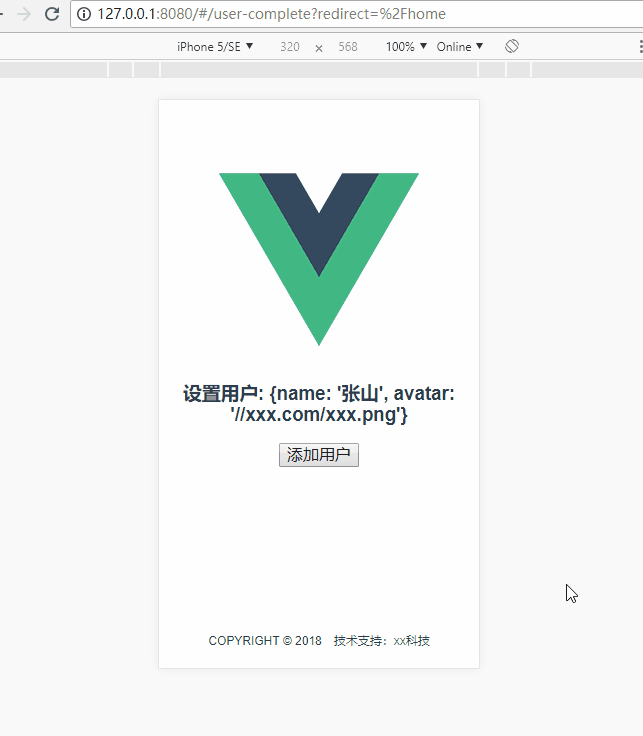

# vue_project_start

> VUE 项目按需配置环境

使用 `vue-cli` 且不使用任何 `UI 框架 `,
主要为了跟进 `vue` 更新和一些常用插件和组件变化。

## 使用的插件和组件
+ axios
+ fastclick
+ [normalize.css](https://github.com/necolas/normalize.css/blob/master/normalize.css)
+ [scss](./src/pages/home/home.vue)
+ vee-validate
+ veu-awesome-swiper
+ vue/vue-router/vuex

## Build Setup

``` bash
# install dependencies
npm install

# serve with hot reload at localhost:8080
npm run dev

# build for production with minification
npm run build

# build for production and view the bundle analyzer report
npm run build --report
```

## 相关资料与关联
+ vue-with-cubeui-start
+ vue-with-vuetify-start
+ vue-with-element-start
+ cTools
+ [vue 项目设计](https://github.com/berwin/Blog/issues/14)
+ [scss 需要安装的依赖](https://note.youdao.com/share/?id=1e05a46346e91c8dc5e810601e112b12&type=note#/)

## 效果演示
#### 路由验证
